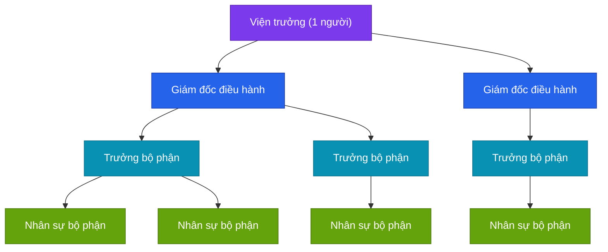
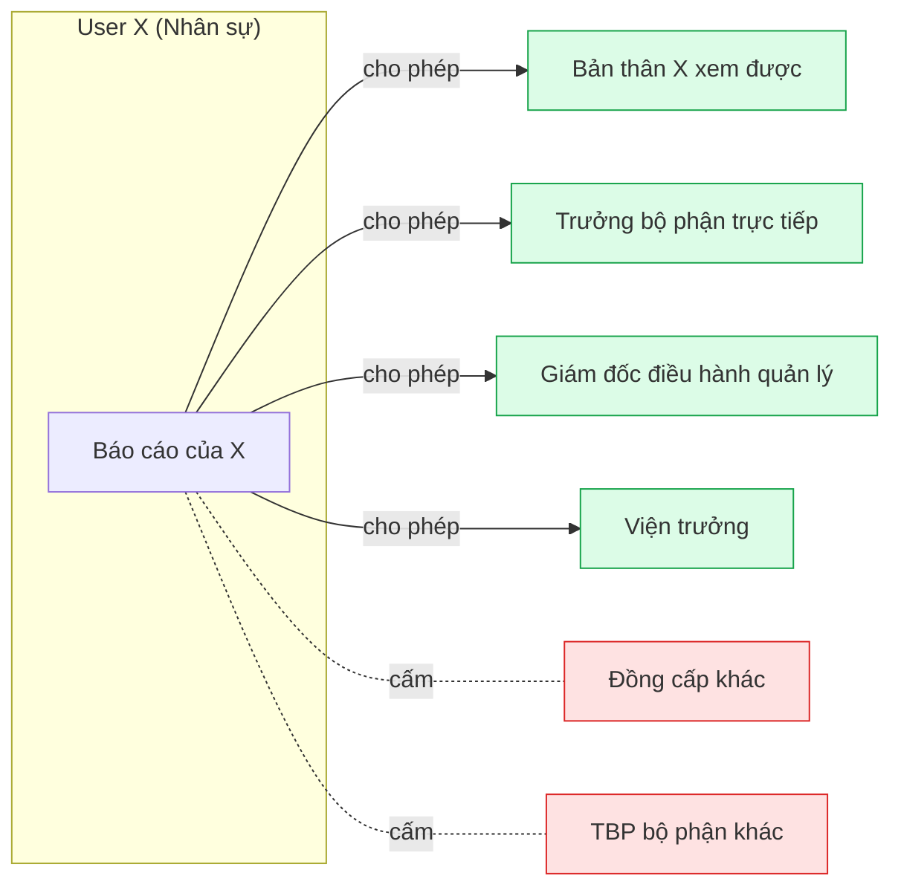
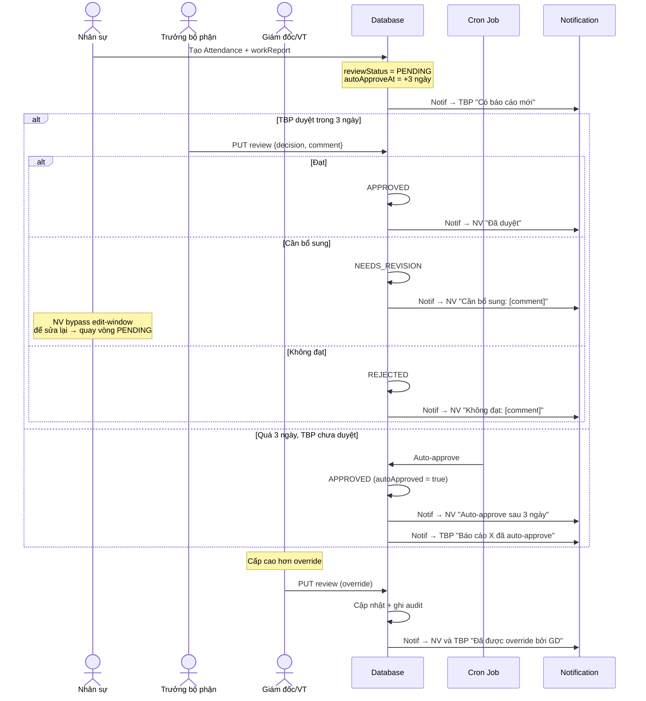
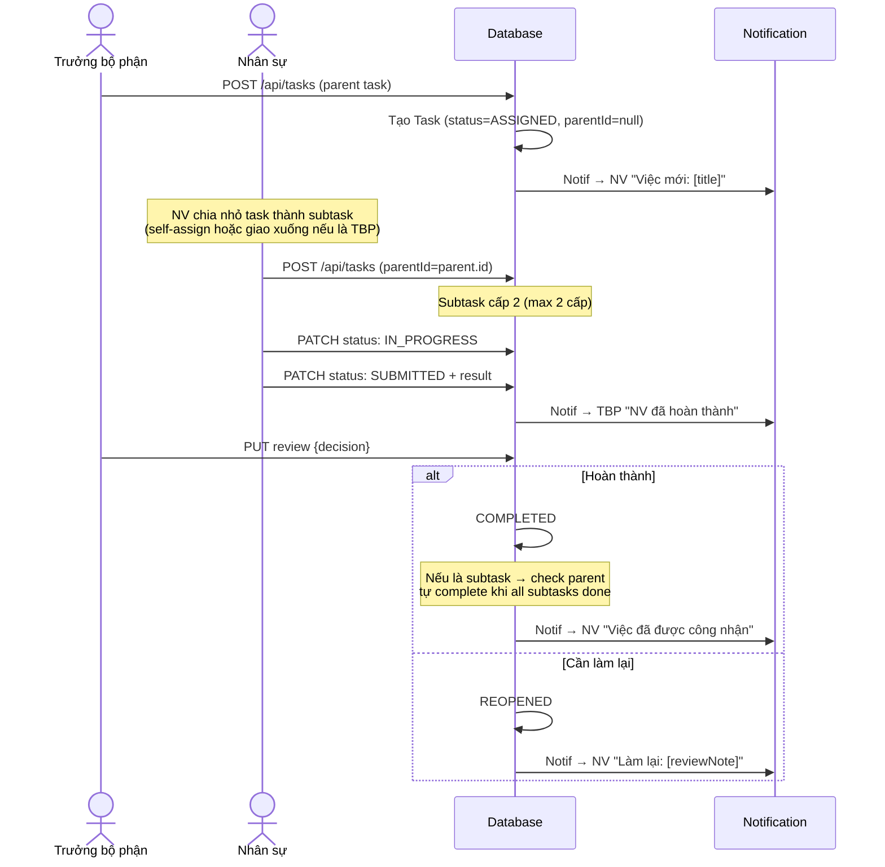
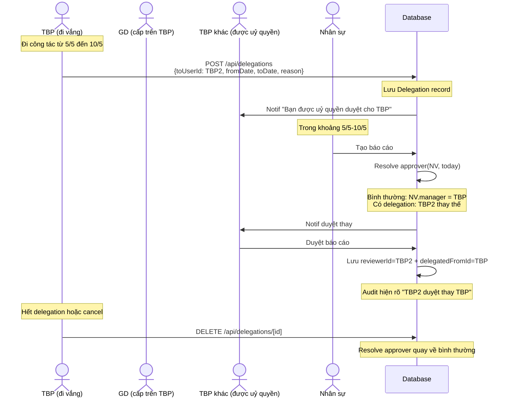
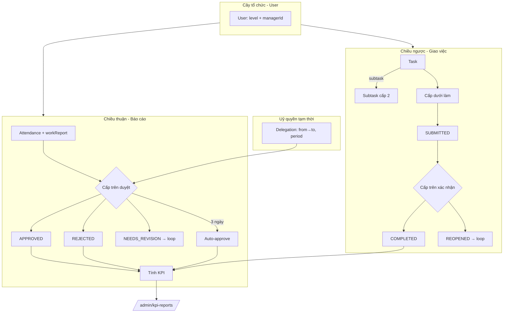
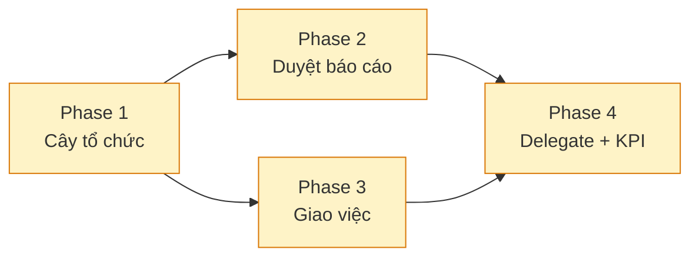

# Plan: Quản lý nhiều cấp + Phê duyệt 2 chiều

**Ngày tạo:** 2026-05-04
**Cập nhật:** 2026-05-04 (sau khi xác nhận yêu cầu)
**Status:** Đã chốt yêu cầu, chờ duyệt plan triển khai

## A. Yêu cầu đã chốt

| # | Câu hỏi | Quyết định |
|---|---------|------------|
| 1 | Số cấp | **4 cấp**: Viện trưởng → Giám đốc điều hành → Trưởng bộ phận → Nhân sự bộ phận |
| 2 | Mỗi user có nhiều cấp trên? | Không. **1 cấp trên trực tiếp** (cây). Cùng cấp chỉ phối hợp, không duyệt chéo |
| 3 | Đạt/Không đạt ảnh hưởng KPI? | **Có** — schema có data, UI/report tạm bỏ qua |
| 4 | Cấp cao override cấp dưới? | **Có** — VT/GD có thể sửa lại quyết định của TBP, bắt buộc lý do |
| 5 | Task có subtask? | **Có** — cha-con, tối đa 2 cấp (giữ KISS) |
| 6 | Auto-approve báo cáo? | **Có, sau 3 ngày** không duyệt → tự động `APPROVED` |
| 7 | Delegate khi cấp trên vắng? | **Có** — bổ nhiệm tạm thời người duyệt thay (có thời hạn) |
| 8 | Viện trưởng chỉ 1 người? | **Có** — duy nhất, `level=VIEN_TRUONG`, `managerId=null` |
| 9 | Admin role vs Viện trưởng | **Tách biệt** — xem A1 ngay dưới |

## A1. Tách Admin (role) vs Viện trưởng (level)

Hai khái niệm khác nhau, lưu trên 2 field riêng:

- `User.role` — **quyền hệ thống**: `ADMIN` | `EMPLOYEE`
- `User.level` — **vị trí trong tổ chức**: `VIEN_TRUONG` | `GIAM_DOC` | `TRUONG_BO_PHAN` | `STAFF`

**Ma trận quyền:**

| Hành động | Admin (role=ADMIN) | Viện trưởng (level=VIEN_TRUONG) |
|-----------|--------------------|---------------------------------|
| Quản lý user (CRUD, set cấp/manager) | ✅ Có | ❌ **Chỉ xem** |
| Xem báo cáo tất cả nhân viên | ✅ Có | ✅ Có (vì là gốc cây) |
| Duyệt báo cáo / override | ✅ Có | ✅ Có |
| Giao việc | ❌ Không | ✅ Có (cho GD) |
| Nhận task | ❌ Không | ✅ Có |
| Chấm công cá nhân | ❌ **Không cần** | ✅ Có |
| Vị trí trong cây tổ chức | **Ngoài cây** | Gốc cây, `managerId=null` |
| Quản lý hệ thống (debug, settings) | ✅ Có | ❌ Không |

**Kết hợp khả dĩ:**
- 1 user có thể là `role=ADMIN` + `level=STAFF/null` (chỉ kỹ thuật, không nghiệp vụ)
- 1 user có thể là `role=EMPLOYEE` + `level=VIEN_TRUONG` (chỉ lãnh đạo, không kỹ thuật)
- 1 user có thể là `role=ADMIN` + `level=VIEN_TRUONG` (vừa kỹ thuật vừa lãnh đạo — VD founder)

**Sidebar hiển thị (theo role + level):**

| Mục | Admin | VT | GD/TBP | STAFF |
|-----|-------|----|----|------|
| Tổng quan (dashboard) | ✓ | ✓ | ✓ | ✓ |
| Chấm công cá nhân | ❌ | ✓ | ✓ | ✓ |
| Báo cáo của tôi | ❌ | ✓ | ✓ | ✓ |
| Yêu cầu sửa của tôi | ❌ | ✓ | ✓ | ✓ |
| My-team (xem cấp dưới + duyệt) | ❌ | ✓ | ✓ | ❌ |
| My-tasks (việc được giao) | ❌ | ✓ | ✓ | ✓ |
| Team-tasks (giao việc) | ❌ | ✓ | ✓ | ❌ |
| Quản lý nhân viên | ✅ CRUD | 👁 chỉ xem | ❌ | ❌ |
| Cây tổ chức | ✅ | ✅ | ✅ | ✅ |
| Chấm công tổng hợp (all) | ✅ | ✅ | ❌ | ❌ |
| Báo cáo tổng hợp (all) | ✅ | ✅ | ❌ | ❌ |
| Yêu cầu sửa (admin duyệt) | ✅ | ❌ | ❌ | ❌ |
| Cài đặt | ✓ | ✓ | ✓ | ✓ |

## B. Sơ đồ tổng thể

### B1. Cây tổ chức 4 cấp



### B2. Phân quyền xem báo cáo



**Quy tắc:** xem được báo cáo của user X ⟺ user hiện tại nằm trong chuỗi cấp trên của X (đệ quy lên gốc) **hoặc** chính là X.

### B3. Chiều thuận — Duyệt báo cáo



### B4. Chiều ngược — Giao việc + Subtask



### B5. Cơ chế Delegate (uỷ quyền duyệt)



**Lưu ý:** chỉ cấp trên cùng level hoặc cao hơn mới được nhận uỷ quyền. VT có thể uỷ quyền cho 1 GD bất kỳ.

### B6. Tổng thể luồng dữ liệu + ảnh hưởng KPI



## C. Schema chi tiết

```prisma
model User {
  id          String  @id @default(cuid())
  email       String  @unique
  password    String
  name        String
  role        String  @default("EMPLOYEE")    // giữ cho backward-compat (admin/employee)
  level       String  @default("STAFF")        // VIEN_TRUONG | GIAM_DOC | TRUONG_BO_PHAN | STAFF
  managerId   String?                           // FK self-ref
  position    String?                           // VD: "GĐ Điều hành phụ trách Vận hành"
  createdAt   DateTime @default(now())
  updatedAt   DateTime @updatedAt

  manager       User?  @relation("ManagerSubordinates", fields: [managerId], references: [id])
  subordinates  User[] @relation("ManagerSubordinates")
  attendances   Attendance[]
  // ... các relation cũ
  assignedTasks    Task[]        @relation("Assignee")
  createdTasks     Task[]        @relation("Assigner")
  reviewedAttendances Attendance[] @relation("AttendanceReviewer")
  delegationsFrom  Delegation[]  @relation("DelegationFrom")
  delegationsTo    Delegation[]  @relation("DelegationTo")
}

model Attendance {
  // ... fields cũ giữ nguyên
  reviewStatus  String?    // null | PENDING | APPROVED | NEEDS_REVISION | REJECTED
  reviewerId    String?
  reviewComment String?
  reviewedAt    DateTime?
  autoApproveAt DateTime?  // = createdAt + 3 ngày
  autoApproved  Boolean    @default(false)
  delegatedFromId String?  // nếu reviewer duyệt thay người khác

  reviewer User? @relation("AttendanceReviewer", fields: [reviewerId], references: [id])

  @@index([reviewStatus, autoApproveAt])
  @@index([reviewerId])
}

model Task {
  id          String   @id @default(cuid())
  parentId    String?                              // null = task gốc; có giá trị = subtask
  title       String
  description String?
  assignerId  String
  assigneeId  String
  priority    String   @default("NORMAL")          // LOW | NORMAL | HIGH | URGENT
  dueDate     String?                               // YYYY-MM-DD
  status      String   @default("ASSIGNED")        // ASSIGNED | IN_PROGRESS | SUBMITTED | COMPLETED | REOPENED | CANCELLED
  result      String?
  reviewNote  String?
  createdAt   DateTime @default(now())
  submittedAt DateTime?
  completedAt DateTime?

  parent   Task?  @relation("TaskHierarchy", fields: [parentId], references: [id], onDelete: Cascade)
  children Task[] @relation("TaskHierarchy")
  assigner User   @relation("Assigner", fields: [assignerId], references: [id])
  assignee User   @relation("Assignee", fields: [assigneeId], references: [id], onDelete: Cascade)

  @@index([assigneeId, status])
  @@index([assignerId])
  @@index([parentId])
}

model Delegation {
  id          String   @id @default(cuid())
  fromUserId  String                       // người uỷ quyền (vắng)
  toUserId    String                       // người được uỷ quyền duyệt thay
  fromDate    String                       // YYYY-MM-DD
  toDate      String                       // YYYY-MM-DD
  reason      String?
  active      Boolean  @default(true)      // có thể cancel sớm
  createdAt   DateTime @default(now())

  fromUser User @relation("DelegationFrom", fields: [fromUserId], references: [id], onDelete: Cascade)
  toUser   User @relation("DelegationTo",   fields: [toUserId],   references: [id], onDelete: Cascade)

  @@index([fromUserId, active])
  @@index([toUserId, active])
}
```

## D. Phase triển khai

### Phase 1 — Cây tổ chức (foundation)
**Output:** User có level + managerId, phân quyền xem dữ liệu theo cây
- Migration thêm `level`, `managerId`, `position`
- Helper `getSubordinatesRecursive(userId)`, `isManagerOf(a, b)` trong [src/lib/org-tree.ts](src/lib/org-tree.ts)
- Validate vòng lặp khi set managerId
- UI `/admin/users` thêm dropdown "Cấp trên" + dropdown "Cấp" + cột position
- Trang `/admin/org-chart` xem cây tổ chức
- Update `findAttendances`, `dashboard/summary`, `export` scope theo cây
- Trang `/my-team` cho cấp trên xem báo cáo cấp dưới (replace ý nghĩa /admin/attendance cho TBP/GD; ADMIN role vẫn xem all)
- Migration data: gán default level cho user hiện có (admin → VT, employee → STAFF, manager = VT)

### Phase 2 — Duyệt báo cáo (chiều thuận)
**Output:** Cấp trên duyệt báo cáo, auto-approve 3 ngày, override
- Migration Attendance: thêm 6 field review
- API `PUT /api/attendance/[id]/review` với decision = APPROVED | NEEDS_REVISION | REJECTED
- Validate: chỉ cấp trên (kể cả gián tiếp) mới duyệt được
- NEEDS_REVISION: bypass edit window 3 ngày
- Cron auto-approve: tận dụng Vercel Cron `/api/cron/auto-approve` chạy hằng ngày 00:01
- Notification: tạo báo cáo mới, có quyết định, override, auto-approve
- UI `/my-team`: list báo cáo cấp dưới với 3 nút Đạt/Không đạt/Cần bổ sung + comment
- Filter `/my-team`: theo reviewStatus + theo cấp dưới (recursive hay direct only)
- Badge sidebar: số báo cáo đang chờ duyệt (chỉ direct subordinates)
- Trang `/admin/kpi-reports` (cho VT/GD): % báo cáo đạt/không đạt/cần bổ sung theo user/tháng

### Phase 3 — Giao việc (chiều ngược)
**Output:** Hệ thống Task có cha-con, notification, dashboard
- Bảng Task + migration
- API CRUD: POST/GET/PATCH/PUT review/DELETE
- Validate giao việc: assignerId phải là cấp trên của assigneeId (kể cả gián tiếp)
- Subtask: parent.assignee có quyền tạo subtask, level depth max 2
- Trang `/my-tasks` cho user (Tab: Mới được giao / Đang làm / Đã nộp / Hoàn thành / Quá hạn)
- Trang `/team-tasks` cho cấp trên (giao mới + theo dõi tiến độ)
- Modal tạo task với chọn assignee (multi-level dropdown từ cây)
- Notification mọi state transition
- Banner dashboard "N việc quá hạn" + "M việc cần xác nhận"
- Khi parent task có subtask: auto-complete khi all children = COMPLETED

### Phase 4 — Delegate + Polish
**Output:** Uỷ quyền, audit, KPI report đầy đủ
- Bảng Delegation + migration
- API `/api/delegations` POST/GET/DELETE
- Helper `resolveApprover(userId, date)` trả về reviewer thực tế (có delegate hay không)
- Update review API: lưu `delegatedFromId` khi reviewer là người được uỷ quyền
- Trang `/settings/delegations`: tạo/cancel delegation
- Trang `/admin/kpi-reports`: tổng hợp KPI từ Attendance review + Task completion theo user/team/tháng
- Audit log cho thay đổi managerId, override review, delegate
- Cảnh báo xoá user là cấp trên: bắt admin re-assign cấp dưới trước
- Export PDF/Excel: thêm cột reviewStatus, reviewer, reviewComment

## E. Sơ đồ phụ thuộc giữa các phase



**Bắt buộc:** Phase 1 trước, vì Phase 2 và 3 đều phụ thuộc cây tổ chức.
**Có thể song song:** Phase 2 và 3 (độc lập nhau, dùng chung helper org-tree).
**Phải sau cùng:** Phase 4 (delegate cần review, KPI cần cả review + task).

## F. Rủi ro & cách xử lý

| Rủi ro | Mức độ | Xử lý |
|--------|--------|-------|
| Vòng lặp managerId | Cao | Validate đệ quy trước khi save |
| Recursive subordinates chậm | Trung | Cache theo session; <500 user thì OK |
| Auto-approve cron không chạy đều | Cao | Vercel Cron + log; thêm "lazy" check khi xem dashboard |
| Cấp trên đi vắng dài không delegate | Trung | Auto-approve 3 ngày sẽ tự xử |
| Override gây tranh cãi | Trung | Audit log + notif cho TBP biết |
| Delete user là cấp trên | Cao | Bắt re-assign cấp dưới trước khi cho xoá |
| Migration data hiện có (chưa có level) | Trung | Script seed: admin→VT, employee→STAFF, manager=VT; admin sửa lại sau |
| Backward compat với role ADMIN/EMPLOYEE | Trung | Giữ field role; thêm level song song; rule cuối: ADMIN vẫn full access |

## G. Quyết định cuối (đã chốt)

- **Auto-approve xong**: không unlock cho TBP duyệt lại; muốn sửa → cấp cao hơn override
- **Subtask**: TBP/GD assignee được giao xuống cấp dưới; STAFF tự làm
- **KPI**: tạm thời bỏ qua; thiết kế schema vẫn lưu data đầy đủ để sau này build report
- **Delegation**: VT chọn 1 GD; GD/TBP chọn người cùng cấp khác hoặc cấp cao hơn
- **Override**: bắt buộc reviewComment
